[toc]

# 1神经网络概述

## **目的**：
*主要是为了提取不那么明显的特征*

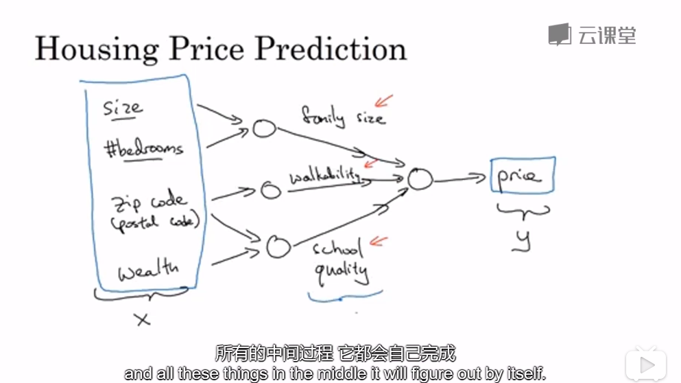

## **常用例子**
：audio/文字都可以当成有序的时间序列所以是RNN来处理

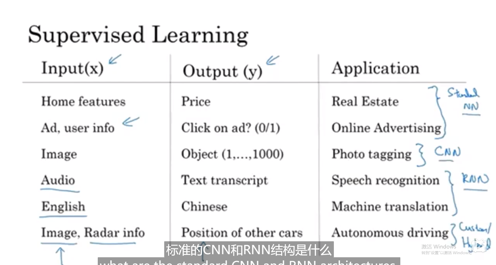

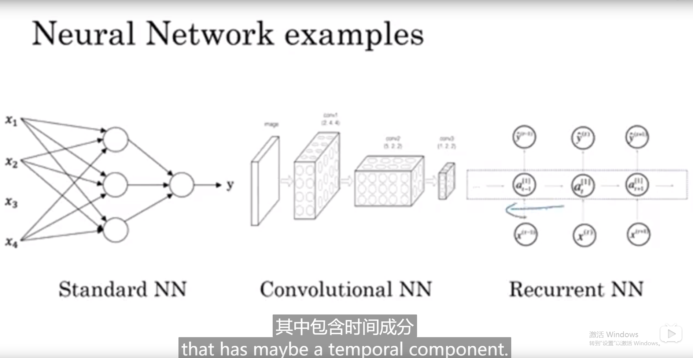

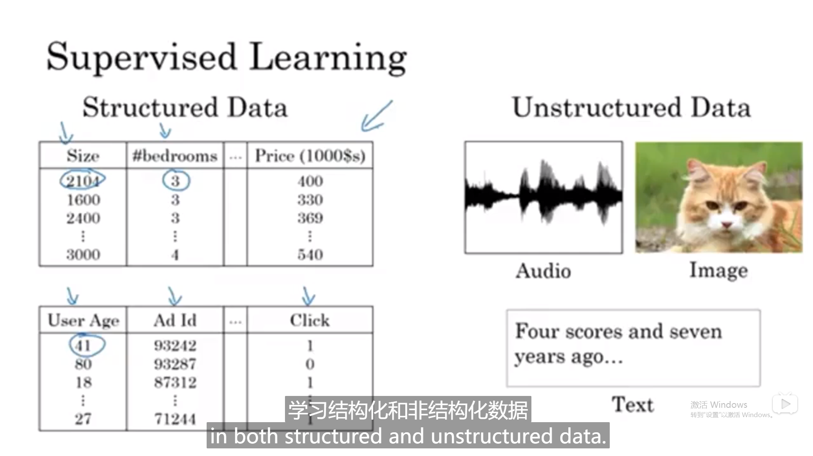

处理数据源的格式，结构化每一个的意思

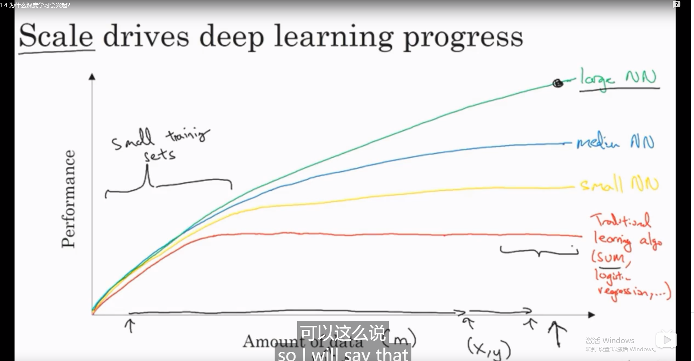

## **各个网络**算力对比

近年能表现这么好得益于scale（数据集），数据和网络参数的/训练集不大的时候svm可能更好，但是训练集大了之后large NN，得益于（技术支持）---算法sigmoid的斜率低导致学习慢-->Relu斜率不变就快了很多。

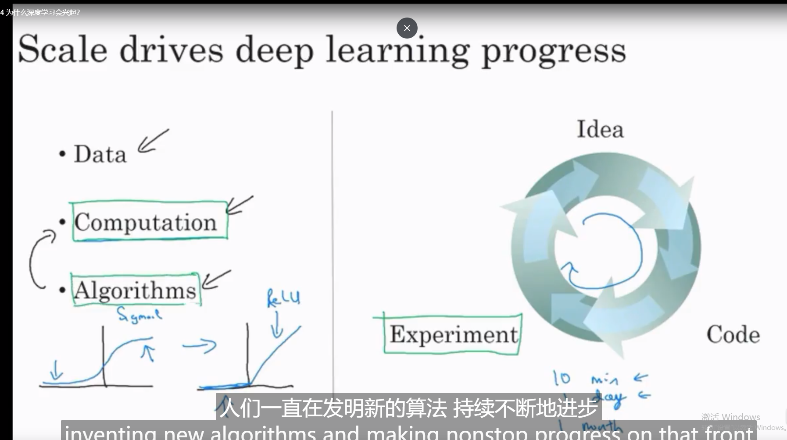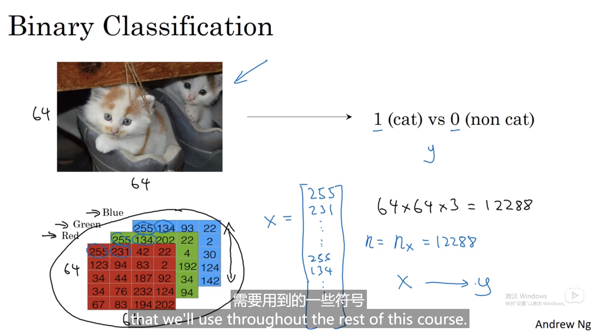

## 二分分类

x属于nx维度的向量，X有m个可用python拼起来

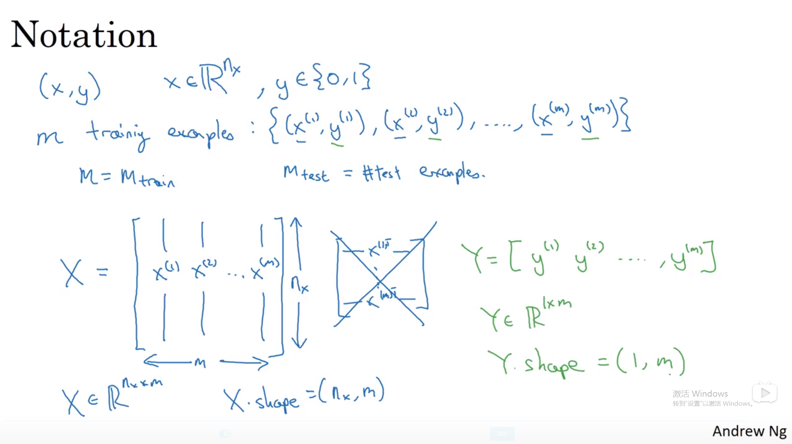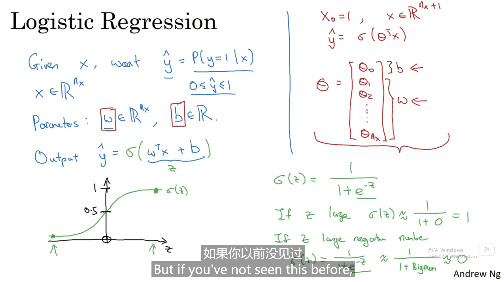

# 2 logistic回归

## 2.1 表达

w,b分开来看比较好这样就是

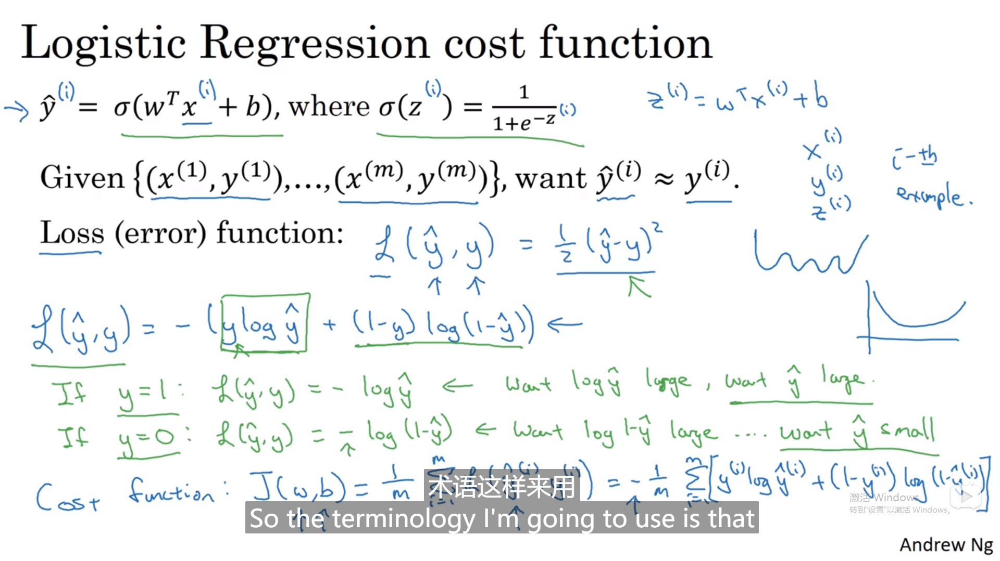

loss是对单，cost是对总的训练样本，找到合适的w，b来尽可能小。

对于logistics用（）^2只会更多局部最优解。

## 2.2 计算步骤：正向反向传播例子

对关心的变量的导数传导）

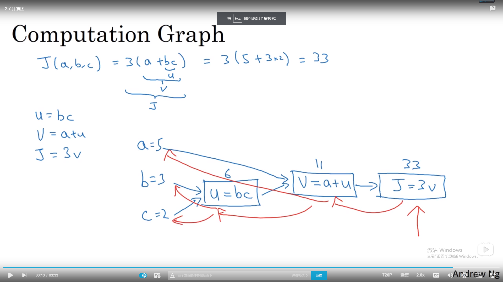

反向例子（da代表a对最终变化率的影响）

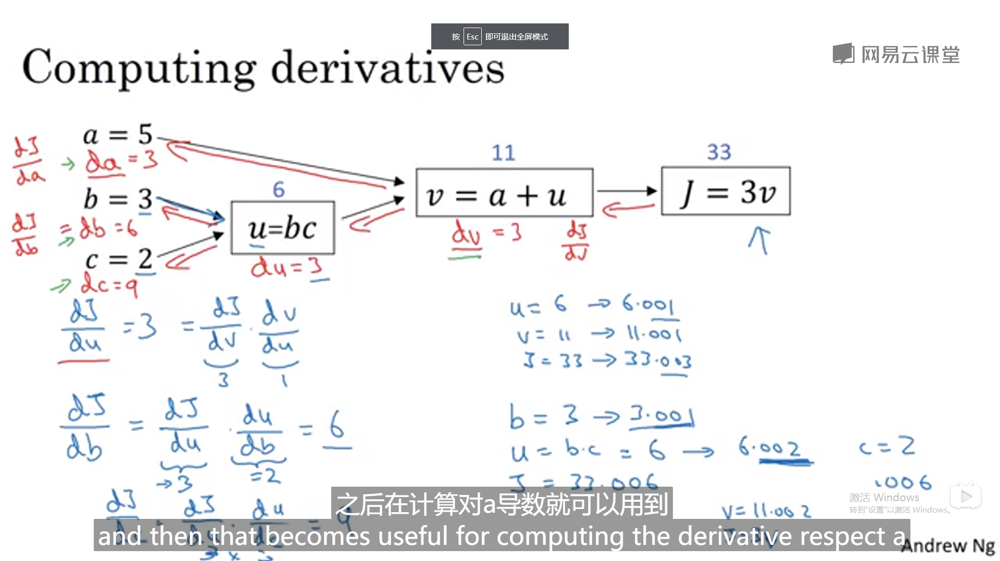

沿着红色箭头走最好因为前变化率可在后面用到

### logistic反向传播的单个例子

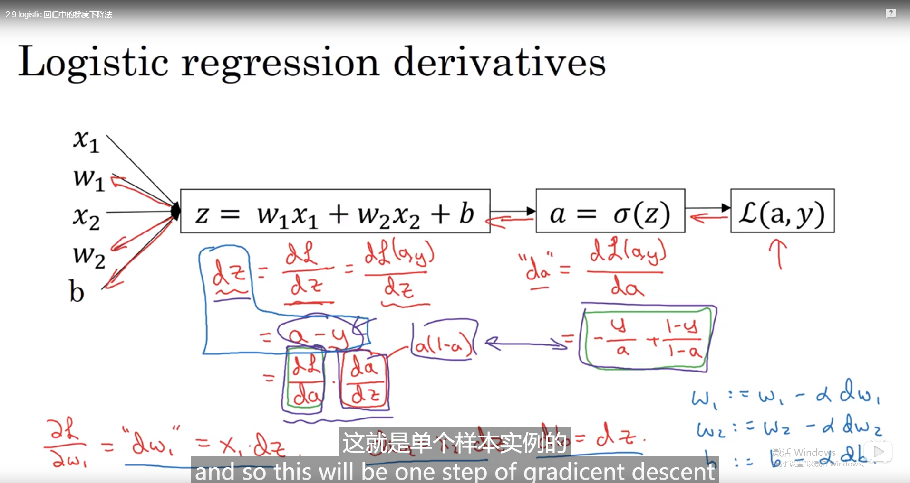

### m个例子

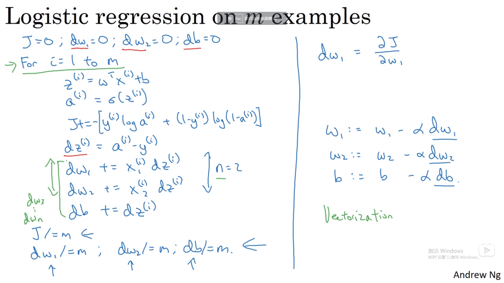

1->m需要一个for，dw1->dwn需要一个for

#### 避免for loop

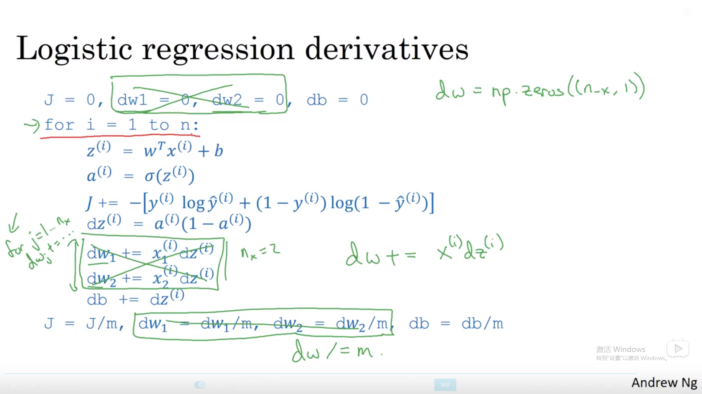